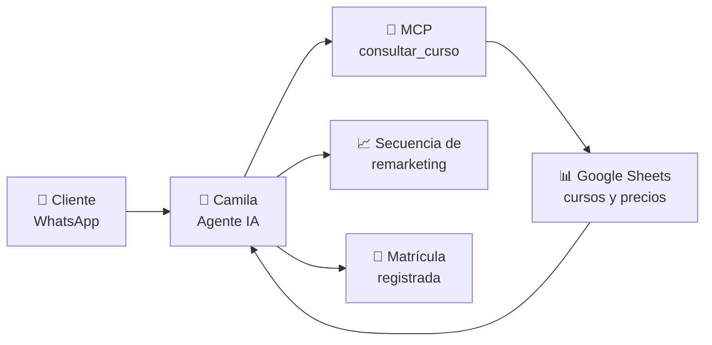

<!-- ══════════════ HEADER ANIMADO ══════════════ -->
<p align="center">
  
</p>

<p align="center">
  <a href="https://github.com/Alessandro-BS">
    
  </a>
</p>

<p align="center">
  
  
  
</p>

<!--horizontal divider(gradiant)-->


## <picture></picture> Acerca de mí

Estudiante de Ingeniería de Software de 7.º ciclo, apasionado por la construcción de soluciones robustas y escalables. Actualmente enfocado en Desarrollo Full Stack, aplicando principios de Clean Architecture y buenas prácticas de desarrollo. Cuento con experiencia en el diseño de sistemas de gestión y herramientas de automatización, siempre priorizando la seguridad y la eficiencia del código. Constantemente aprendiendo sobre ciberseguridad e integración de IA para potenciar la productividad en el ciclo de vida del software.

```yaml
nombre:      "Aless Bustamante"
rol:         "Full Stack Developer"
ubicacion:   "Lima, Perú 🇵🇪"
enfoque:     ["Clean Architecture", "APIs REST", "Automatización con IA"]
aprendiendo: ["Ciberseguridad", "Cloud", "Agentes de IA"]
lema:        "Código seguro, eficiente y mantenible."
```

<div align="center">
<br/>
</div>
<div>
<picture> </picture>
</div>

<br clear="both"/>

<p align="center">
  
</p>

<p align="center">
  
</p>

<p align="center">
  
  
  
</p>

<p align="center">
  
</p>

<!--horizontal divider(gradiant)-->


#  Proyectos en los que estoy trabajando

### 🤖 Camila — Agente de WhatsApp con IA · <sub>Corporación Educativa IPSE</sub>

Agente conversacional que informa sobre la oferta de cursos y gestiona matrículas por
WhatsApp. Diseño completo del flujo de mensajes, secuencias de remarketing y reglas
comerciales. Los datos de cursos y precios se consultan en tiempo real desde Google
Sheets mediante una herramienta MCP (`consultar_curso`) expuesta con Apps Script.

     



<!--horizontal divider(gradiant)-->


# 💻 Tech Stack:
## 🔧 Languages
          

## 🛢 Databases
    

## 🎨 Design
 

## ⚛️ Frameworks, Platforms and Libraries
                    

## 🚀 CVS
     

## ☁️ Cloud Hosting & Providers
     

## ⚙️ Servers & Package Managers
   

## 📊 Data Science & Analysis
 

## 💼 Other
    

## 🎮 Hardware & Platforms

    

<!--horizontal divider(gradiant)-->


<!-- ══════════════ SNAKE (requiere el workflow .github/workflows/snake.yml) ══════════════ -->
<h3 align="center">🐍 Mis contribuciones, devoradas</h3>

<picture>
  <source media="(prefers-color-scheme: dark)" srcset="https://raw.githubusercontent.com/Alessandro-BS/Alessandro-BS/output/github-snake-dark.svg" />
  <source media="(prefers-color-scheme: light)" srcset="https://raw.githubusercontent.com/Alessandro-BS/Alessandro-BS/output/github-snake.svg" />
  
</picture>

<br />
<hr />
<p align="center">
🇵🇪 Lima, Perú 🇵🇪
</p>

<p align="center">
  
</p>
