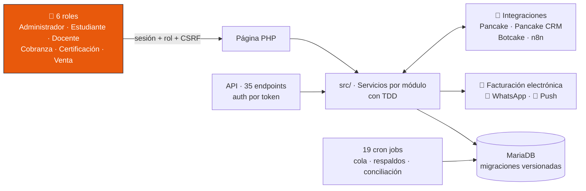
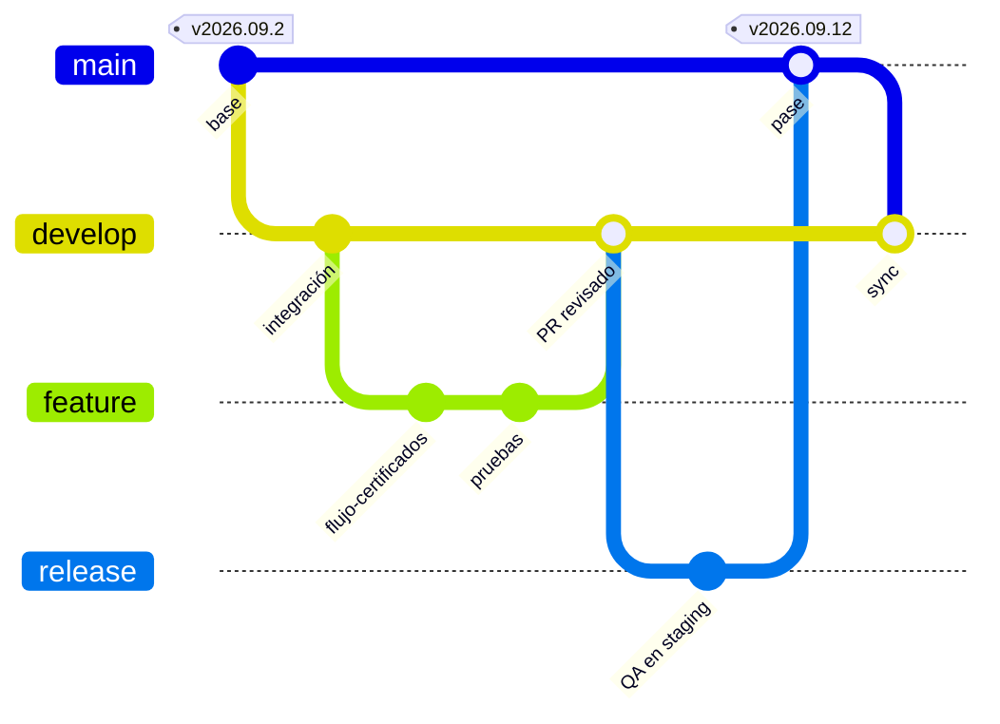
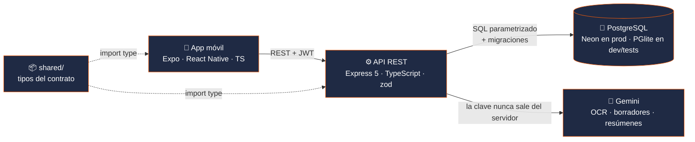
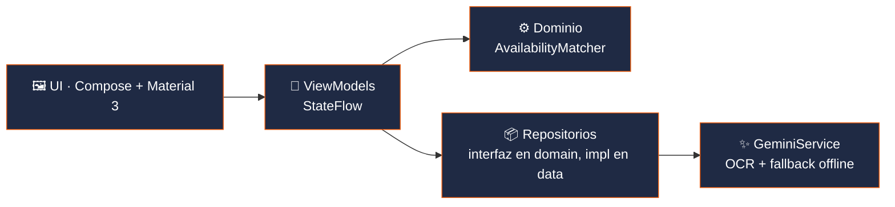
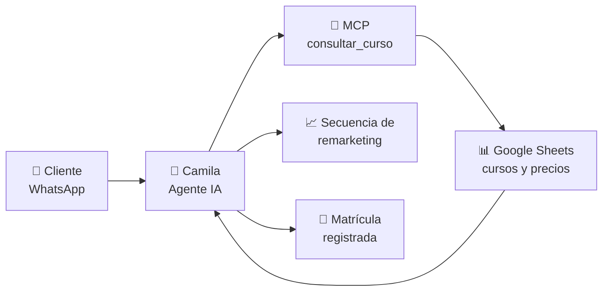
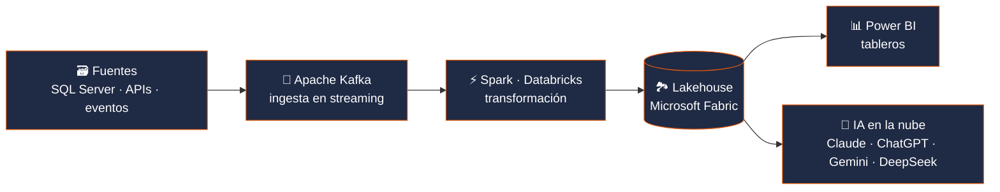
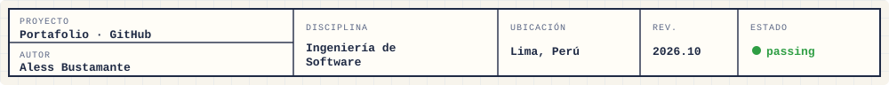

<!-- ═══════════════════════════ HERO ═══════════════════════════ -->
<a href="https://github.com/Alessandro-BS">
  
</a>

<p align="center">
  <a href="https://github.com/Alessandro-BS">
    
  </a>
</p>

<p align="center">
  <a href="#-proyectos-destacados"></a>
  <a href="#-stack-tecnológico"></a>
  <a href="#-actividad-en-github"></a>
  <br/>
  
  
  
</p>

<br/>

## 🧑‍💻 Sobre mí

Soy **Aless Bustamante**, estudiante de **Ingeniería de Software (8.º ciclo)** en la Universidad Tecnológica del Perú y desarrollador **Full Stack** en Lima. Me gusta construir software que se usa de verdad: mantengo en producción el **aula virtual de un consorcio de cuatro institutos**, desarrollo una **app móvil** para coordinar horarios en grupo y diseño **agentes de IA** que atienden por WhatsApp.

Trabajo con **Clean Architecture**, pruebas automatizadas y **Git Flow**, y hoy oriento mi carrera hacia la **Ingeniería de Datos** y la **IA en la nube**.

```console
$ git log --oneline --graph aless/carrera
* 4f2c9e1 (HEAD -> main) feat(lms): Educa LMS en producción para 3 institutos
* 9a7d03b feat(movil): HueckoApp v1.0.0 nativa → v2 full stack en develop
* c18e5f2 feat(ia): Camila, agente de WhatsApp con MCP
* 2b6a4d8 chore(aprendizaje): ingeniería de datos · IA en la nube · ciberseguridad
* 0e1f7a3 init: Ingeniería de Software
```

---

## 📐 Proyectos destacados

### 🎓 Educa LMS &nbsp;<sub> </sub>



Aula virtual propia de un consorcio educativo peruano (**EDUCA · IPSE · ICEPP · CESUP**). Cada instituto tiene su servidor, su base de datos y su marca, pero el código **se escribe una sola vez**: una herramienta generadora toma una versión etiquetada de `main` y produce la variante de cada marca (nombre, colores, logo, series de facturación). Cubre todo el ciclo del alumno: venta, matrícula, cobranza con comprobantes electrónicos, clases, exámenes y certificados.

Además, lo estoy **integrando con el ecosistema comercial** del consorcio: **Pancake** y **Pancake CRM** para ventas y atención, **Botcake** para los bots de WhatsApp y **n8n** para automatizar los flujos entre el aula virtual, el CRM y la mensajería.

<p>
  
  
  
  
  
  
  <br/>
  
  
  
  
</p>

<details>
<summary><b>🏗️ Arquitectura — ver cómo está construido</b></summary>
<br/>


```mermaid
flowchart LR
    R["👥 6 roles<br/>Administrador · Estudiante · Docente<br/>Cobranza · Certificación · Venta"]:::r
    R -->|sesión + rol + CSRF| P[Página PHP]
    P --> S["src/ · Servicios por módulo<br/>con TDD"]
    S --> DB[(MariaDB<br/>migraciones versionadas)]
    API["API · 35 endpoints<br/>auth por token"] --> S
    CRON["19 cron jobs<br/>cola · respaldos · conciliación"] --> DB
    S --> EXT["🧾 Facturación electrónica<br/>💬 WhatsApp · 🔔 Push"]
    S <--> INT["🔗 Integraciones<br/>Pancake · Pancake CRM<br/>Botcake · n8n"]
    classDef r fill:#e8590c,color:#fff,stroke:#1f2a44
```

- **Dos capas que conviven:** las páginas por rol validan sesión, rol y CSRF; la lógica de negocio nueva vive en `src/` por módulos (Académico, Cobros, Certificados, Ventas, Soporte) con **TDD**.
- **Esquema solo por migraciones** fechadas — nunca un `CREATE TABLE` escondido en una página.
- **Cola de envíos concurrente segura** entre marcas del mismo servidor (`SELECT … FOR UPDATE SKIP LOCKED` + candado por sitio).
- **Seguridad:** secretos solo en `.env` por servidor, nada de credenciales en el repositorio, y el staging tiene la facturación neutralizada para no emitir comprobantes reales.

</details>

<details>
<summary><b>🌿 Flujo de trabajo — Git Flow con staging y pases ensayados</b></summary>
<br/>


```mermaid
gitGraph
    commit id: "base" tag: "v2026.09.2"
    branch develop
    checkout develop
    commit id: "integración"
    branch feature
    checkout feature
    commit id: "flujo-certificados"
    commit id: "pruebas"
    checkout develop
    merge feature id: "PR revisado"
    branch release
    checkout release
    commit id: "QA en staging"
    checkout main
    merge release id: "pase" tag: "v2026.09.12"
    checkout develop
    merge main id: "sync"
```

| Rama | Para qué | Entorno |
|---|---|---|
| `feature/*` | Un cambio; vuelve por Pull Request | Local / staging |
| `develop` | Integración de lo terminado | **Staging** |
| `release/*` | Congelado para QA final | Staging |
| `main` | Lo que corre en producción, con etiqueta `vAAAA.MM.N` | **Producción** |
| `hotfix/*` | Error urgente: sale de `main`, vuelve a `main` y `develop` | — |

Cada pase a producción es un **script ensayado sobre una copia desechable**, ejecutado a mano y con su vuelta atrás preparada.

</details>

<br/>

### 📱 HueckoApp &nbsp;<sub><a href="https://github.com/Alessandro-BS/HueckoApp-Android"></a>  <a href="https://github.com/Alessandro-BS/HueckoApp-Android/tree/develop"></a></sub>

<a href="https://github.com/Alessandro-BS/HueckoApp-Android">
  
</a>

Coordinar un plan por chat es un caos. **HueckoApp** cruza los horarios de todo el grupo, muestra los **huecos libres en común** y deja que el grupo **vote** propuestas con lugar y plazo. El horario se carga a mano o **desde una foto** con Gemini, y si alguien reporta un imprevisto el plan se reabre.

Nació como **app Android nativa** (Kotlin + Jetpack Compose, `v1.0.0`) y hoy evoluciona a un **monorepo full stack**: app con Expo / React Native, API REST propia y la IA solo del lado del servidor.

<p>
  
  
  
  
  
  
  
</p>

<details>
<summary><b>🏗️ Arquitectura v2 — monorepo full stack</b></summary>
<br/>


```mermaid
flowchart LR
    A["📱 App móvil<br/>Expo · React Native · TS"] -- "REST + JWT" --> B["⚙️ API REST<br/>Express 5 · TypeScript · zod"]
    B -- "SQL parametrizado<br/>+ migraciones" --> C[("🐘 PostgreSQL<br/>Neon en prod · PGlite en dev/tests")]
    B -- "la clave nunca sale del servidor" --> D["🤖 Gemini<br/>OCR · borradores · resúmenes"]
    S["📦 shared/<br/>tipos del contrato"] -. "import type" .-> A
    S -. "import type" .-> B
    classDef k fill:#1f2a44,color:#fff,stroke:#e8590c
    class A,B,C,D,S k
```

- **Seguridad:** JWT en `expo-secure-store`, contraseñas con bcrypt, roles `USER`/`ADMIN` validados en cada petición y límite de llamadas a la IA por usuario.
- **IA robusta:** las respuestas de Gemini se validan con zod, hay modelo de respaldo si el principal falla y un modo demostración sin clave.
- **Calidad:** Vitest + Supertest (cada test con su propia base PGlite en memoria) y Jest en mobile; CI con typecheck y tests en cada PR.
- **Móvil de verdad:** cámara y galería, ubicación y selector en el mapa, gráficos e informes PDF/CSV generados en el teléfono.

</details>

<details>
<summary><b>🔍 El algoritmo del “hueco” — por qué no uso el promedio</b></summary>
<br/>

El cruce de agendas es una **función pura** (sin repositorios ni corrutinas), así se prueba con una lista de bloques y nada más. Junta las horas consecutivas en las que el grupo supera su umbral y **describe cada franja por su hora menos disponible**: decir “de 10 a 13 está libre el 80 %” cuando a las 12 solo lo está el 40 % sería prometer un hueco que se rompe a la mitad. *(Versión Kotlin de la v1.)*

```kotlin
val anterior = ventanas.lastOrNull()
if (anterior != null && anterior.endHour == hour) {
    // Prolonga la franja y se queda con el PEOR dato de sus horas
    ventanas[ventanas.lastIndex] = anterior.copy(
        endHour = hour + 1,
        availabilityPercentage = minOf(anterior.availabilityPercentage, porcentaje),
        freeMembers = minOf(anterior.freeMembers, libres),
    )
}
```

</details>

<details>
<summary><b>🤖 v1 nativa — Kotlin, Jetpack Compose y MVVM</b></summary>
<br/>


```mermaid
flowchart LR
    UI["🖼️ UI · Compose + Material 3"] --> VM["🧠 ViewModels<br/>StateFlow"]
    VM --> UC["⚙️ Dominio<br/>AvailabilityMatcher"]
    VM --> REPO["📦 Repositorios<br/>interfaz en domain, impl en data"]
    REPO --> AI["✨ GeminiService<br/>OCR + fallback offline"]
    classDef k fill:#1f2a44,color:#fff,stroke:#e8590c
    class UI,VM,UC,REPO,AI k
```

</details>

<br/>

### 🤖 Camila — Agente de WhatsApp con IA &nbsp;<sub></sub>

Agente conversacional para un instituto que informa la oferta de cursos y gestiona matrículas por WhatsApp. Diseñé el flujo de mensajes, las secuencias de remarketing y las reglas comerciales; los cursos y precios se consultan **en tiempo real** desde Google Sheets mediante una herramienta **MCP** (`consultar_curso`) expuesta con Apps Script.

<p>
  
  
  
  
  
</p>

<details>
<summary><b>💬 Ver el flujo de una conversación</b></summary>
<br/>


```mermaid
flowchart LR
    A["💬 Cliente<br/>WhatsApp"] --> B["🤖 Camila<br/>Agente IA"]
    B --> C["🔌 MCP<br/>consultar_curso"]
    C --> D["📊 Google Sheets<br/>cursos y precios"]
    D --> B
    B --> E["📈 Secuencia de<br/>remarketing"]
    B --> F["📝 Matrícula<br/>registrada"]
```

</details>

---

## ☁️ Interés: Ingeniería de Datos e IA en la nube

<p>
  
  
  
  
  
  
  
  
  <br/>
  
  
  
  
  
  
  
</p>

<details>
<summary><b>🛤️ Ver la ruta que estoy construyendo — del dato crudo a la IA</b></summary>
<br/>


```mermaid
flowchart LR
    SRC["🗃️ Fuentes<br/>SQL Server · APIs · eventos"] --> K["📨 Apache Kafka<br/>ingesta en streaming"]
    K --> SP["⚡ Spark · Databricks<br/>transformación"]
    SP --> LH[("🏞️ Lakehouse<br/>Microsoft Fabric")]
    LH --> BI["📊 Power BI<br/>tableros"]
    LH --> AI["🤖 IA en la nube<br/>Claude · ChatGPT · Gemini · DeepSeek"]
    classDef k fill:#1f2a44,color:#fff,stroke:#e8590c
    class SRC,K,SP,LH,BI,AI k
```

</details>

---

## 🧰 Stack tecnológico

<table>
  <tr>
    <td align="center" width="140"><b>Lenguajes</b></td>
    <td></td>
  </tr>
  <tr>
    <td align="center"><b>Backend</b></td>
    <td></td>
  </tr>
  <tr>
    <td align="center"><b>Frontend y móvil</b></td>
    <td></td>
  </tr>
  <tr>
    <td align="center"><b>Datos</b></td>
    <td></td>
  </tr>
  <tr>
    <td align="center"><b>DevOps y cloud</b></td>
    <td></td>
  </tr>
  <tr>
    <td align="center"><b>Herramientas</b></td>
    <td></td>
  </tr>
</table>

<details>
<summary><b>📚 Ver el stack completo</b></summary>
<br/>

**Lenguajes** &nbsp;
          

**Frameworks y librerías** &nbsp;
                  

**Bases de datos** &nbsp;
     

**DevOps, cloud y servidores** &nbsp;
              

**Calidad, datos y gestión** &nbsp;
           

</details>

---

## 📊 Actividad en GitHub

<p align="center">
  
  
</p>

<details>
<summary><b>📈 Ver más estadísticas</b></summary>
<br/>
<p align="center">
  
  <br/>
  
  
  <br/>
  
</p>
</details>

<!-- La serpiente se genera con .github/workflows/snake.yml -->
<picture>
  <source media="(prefers-color-scheme: dark)" srcset="https://raw.githubusercontent.com/Alessandro-BS/Alessandro-BS/output/github-snake-dark.svg"/>
  <source media="(prefers-color-scheme: light)" srcset="https://raw.githubusercontent.com/Alessandro-BS/Alessandro-BS/output/github-snake.svg"/>
  
</picture>


